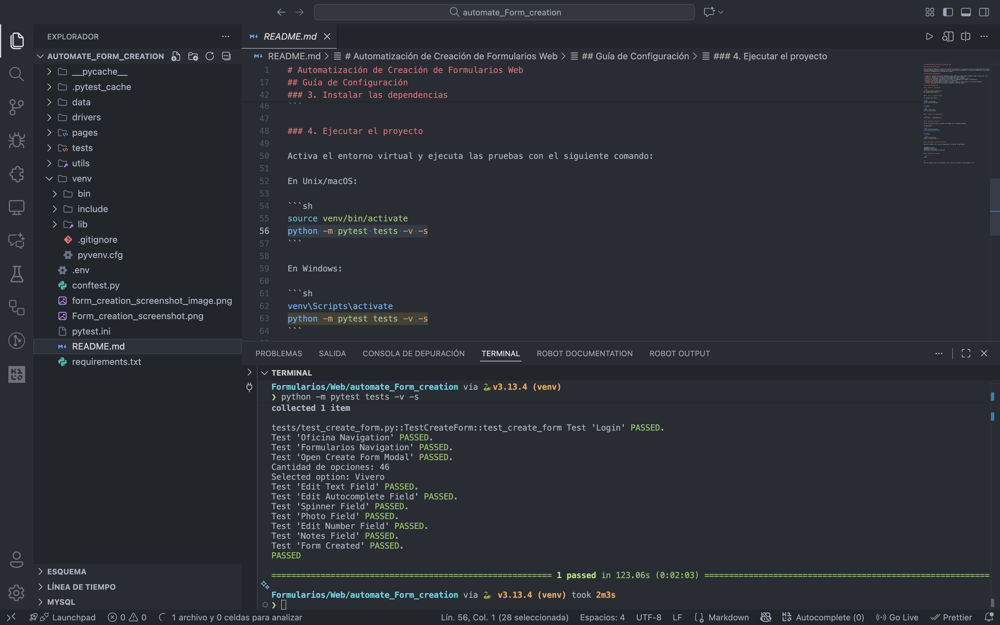
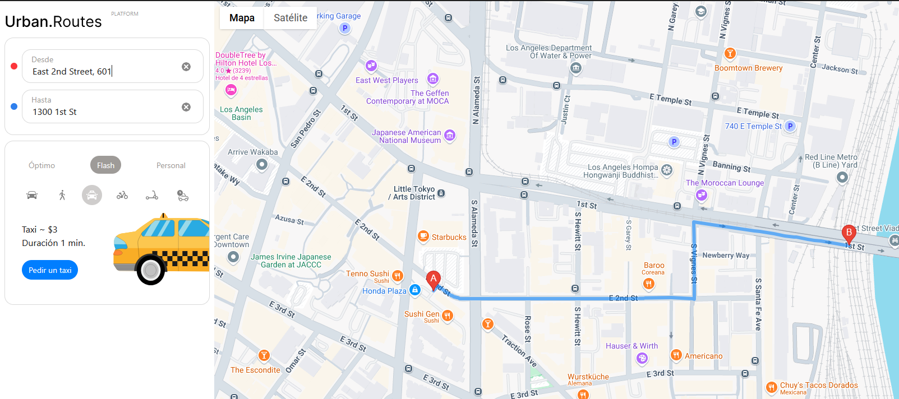
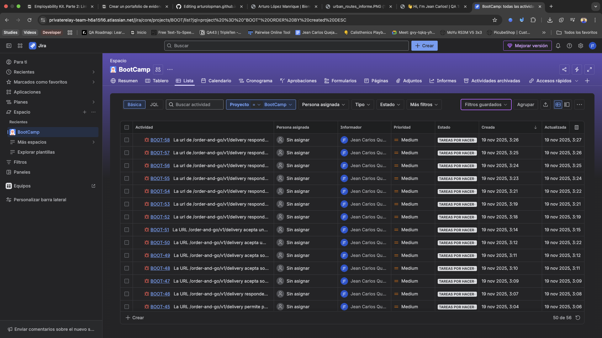

# 👋 Hi, I'm Jean Carlos!

Welcome to my GitHub profile!   

Here you’ll find a collection of projects, test cases, reports, and experiments that reflect my passion for software quality, mobile development, and continuous learning.

  <strong>QA ENGINEER · QA MANUAL TESTER · QA AUTOMATIZADOR JUNIOR</strong>

  
  
  

---

## 📑 Table of Contents
1. [🚀 About Me](#-about-me)  
2. [🛠️ Tech Stack](#️-tech-stack)  
3. [📂 Featured Projects](#-featured-projects)  
4. [📄 Professional Resume](#-professional-resume)  
5. [📬 Let’s Talk](#-lets-talk)

---

## 🚀 About Me

Quality Assurance Engineer with a strong background in mobile development (Kotlin, Java, Swift/SwiftUI, Flutter/Dart), which provides a deep understanding of product architecture and helps identify issues with greater accuracy and context.

I specialize in:

🧪 Manual Testing for mobile, web, and backend services

🔍 Exploratory Testing to uncover edge cases and unexpected behaviors

🔗 API Testing to ensure consistent and reliable integrations

🐞 Bug Reporting & Clear Documentation

📝 Test Case Design, Execution, and Validation

Currently enhancing my skill set through a QA Engineering bootcamp, expanding into test automation and AI-assisted quality engineering to build smarter and more efficient testing workflows.

Passionate about AI, automation, continuous improvement, and staying curious.
Outside of work, I enjoy gaming, testing new gadgets, and exploring smart home technology.

---

## 🌱 What I’m Learning

- Advanced **testing methodologies** (manual & automated).  
- **Mobile QA** practices for Android and iOS.  
- Performance testing, exploratory testing, and bug tracking.  
- Integrating **AI** into development and testing workflows.

---

## 📈 My Goals

- Bridge the gap between **development** and **quality assurance**.  
- Build and test mobile apps that are intuitive, reliable, and scalable.  
- Contribute to open-source projects and learn from the global dev community.  
- Keep improving as a **QA Engineer** and mobile developer.
  
---

## 🛠️ Tech Stack

### 🧪 QA & Testing

### 📋 Gestión & Documentación  

### 💻 Development

### ⚙️ Others

-2496ED?style=for-the-badge)

---

## 📂 Featured Projects

Here are some highlighted QA projects included in this portfolio:

### 🔸 **Automated Form Creation Testing – Sioma Web Platform**
I designed an initial automation flow to validate the form creation process within the Sioma web platform, applying testing best practices and clean Python structuring.

My goal was to reduce repetitive manual testing efforts and ensure that forms were generated correctly under different conditions.
The problem I aimed to solve involved frequent inconsistencies in dynamic fields, incorrect validations, and errors that only appeared when combining multiple input types.
As a result, I learned how to build robust automation scripts using Selenium, manage configurable environments with dotenv, and generate dynamic test data with Faker—successfully automating the form creation process and establishing the foundation for a future automated regression suite.

<video width="500" height="200" controls>
  <source src="assets/videos/demo.mp4" type="video/mp4">
  Tu navegador no soporta video HTML5.
</video>

**Test Results**

  

**Skills & Tools Used**

 

### 🚕 Urban.Routes – Web Application for Taxi Booking
I performed regression testing for **Urban.Routes**, an app that calculates routes, duration, and prices for different transportation methods. I validated the business logic using techniques such as **equivalence classes** and **boundary values**, designing detailed test cases and a **flowchart** for the car-sharing feature.

I created checklists to validate the design of the booking form, pop-up windows, and key functions such as “Add card,” “Payment method,” and the "Book" button. Finally, I executed functional tests in two environments (Chrome and Firefox with specific resolutions) and documented the bugs found in **JIRA**.

**Key Results:**
- ✔️ Designed UI and critical-flow checklists.  
- 🧪 Prepared and executed **positive and negative test cases**.  
- 🧭 Validated key functionalities across different resolutions and browsers.  
- 🐞 Documented functional and UI bugs in **JIRA**.

**Skills & Tools Used**

**Link:** [Documentation](https://drive.google.com/drive/folders/1ZSSoDNSYaJqphbHrNuFywWs5boTavgni?usp=sharing)

**Project screenshots:**  

    

    

---

---

## 📄 Professional Resume

---

## 📬 Let’s Talk

Feel free to reach out if you’d like to collaborate, exchange ideas, or just chat about tech, QA, and mobile development!  

- 💌 [Email Me](mailto:jeanquejadatoro@gmail.com)  
- 🌐 [Instagram](https://www.instagram.com/jeancarlos.quejadatoro?igsh=aWJwaWZucDY4d2ti)  
- 💼 [LinkedIn](https://www.linkedin.com/in/jean-carlos-quejada-toro-3b16831b6?utm_source=share&utm_campaign=share_via&utm_content=profile&utm_medium=android_app)

---

✨ *"Quality is never an accident; it is always the result of intelligent effort."* — John Ruskin
